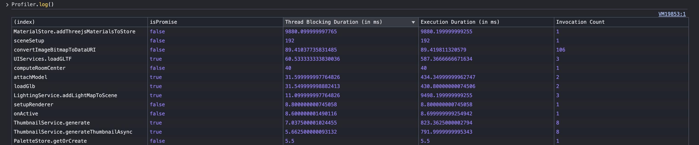
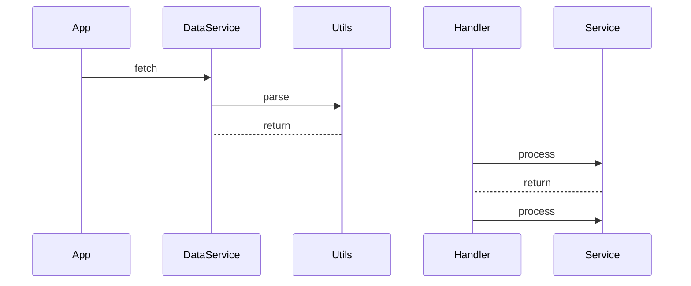

# Profiler.js


A lightweight, non-intrusive performance profiler for JavaScript and TypeScript applications, supporting both browser and Node.js environments.



## Features

- 📊 Measure execution times, thread blocking duration, and invocation frequencies
- 🔄 Profile both synchronous and asynchronous functions
- 📈 Generate sequence diagrams to visualize function call flows
- 💾 Export profiling results to CSV files
- 🎯 Zero dependencies, minimal overhead
- 🛠️ Supports both decorator and function wrapper patterns
- 💻 Works in both browser and Node.js environments
- 📝 TypeScript support with full type definitions
- ⚛️ Compatible with React's Profiler API (including React 18's nested updates)

## Installation

```bash
# Using npm
npm install profiler.js

# Using yarn
yarn add profiler.js

# Using pnpm
pnpm add profiler.js

# Using bun
bun add profiler.js
```

## Usage

Profiler.js provides two ways to profile your code:

1. Using the `@profile` decorator on class methods
2. Using the `profile()` function wrapper for standalone functions

### Using as a Decorator

```typescript
import { profile, profiler } from 'profiler.js';

class UserService {
  @profile
  async fetchUserData(userId: string) {
    // Your async method implementation
    const response = await fetch(`/api/users/${userId}`);
    return response.json();
  }
  
  @profile
  processUserData(data: any) {
    // CPU intensive operations
    // ...
    return transformedData;
  }
}

// Display profiling results
console.table(profiler.getResults());
```

### Using as a Function Wrapper

```typescript
import { profile, profiler } from 'profiler.js';

// Profile a standalone function
const fetchProducts = profile(async (category: string) => {
  const response = await fetch(`/api/products?category=${category}`);
  return response.json();
});

// Profile a synchronous function
const calculateTotal = profile((items: any[]) => {
  return items.reduce((sum, item) => sum + item.price, 0);
});

// Use the functions normally
fetchProducts('electronics').then(products => {
  const total = calculateTotal(products);
  console.log(`Total: $${total}`);
  
  // Show profiling results
  profiler.log();
});
```

### Generating Sequence Diagrams

Profiler.js can generate [Mermaid](https://mermaid-js.github.io/mermaid/#/) sequence diagrams to visualize your application's function call flow:

```typescript
import { profile, profiler } from 'profiler.js';

// Generate sequence diagram after your code executes
const diagram = profiler.generateSequenceDiagram();
console.log(diagram);

// Save the diagram to a file
profiler.generateSequenceDiagram(100, true, "my-sequence-diagram");
```

The sequence diagram shows the flow of function calls with:
- Each class as a separate participant
- Function calls with solid arrows
- Function returns with dotted arrows
- Automatic detection and highlighting of circular call patterns

#### Sample Sequence Diagram Output



### Exporting Results to CSV

You can export profiling results to a CSV file for further analysis:

```typescript
// Export profiling results to a CSV file
profiler.getResults(true, "performance-analysis");
```

### Using with React

Profiler.js is compatible with React's Profiler API, allowing you to monitor component render performance:

```jsx
import React from 'react';
import { profile, profiler } from 'profiler.js';

// Use as the onRender callback for React's Profiler component
function App() {
  return (
    <React.Profiler id="MyComponent" onRender={profile}>
      <MyComponent />
    </React.Profiler>
  );
}

// Later, check the component's render performance
console.log(profiler.componentData);
```

#### React 18 Support

Profiler.js fully supports React 18's enhanced profiling, including the new `nested-update` phase introduced in React 18 for concurrent rendering. This allows you to accurately profile components in applications using React's concurrent features:

```jsx
// Works with React 18's concurrent features
function App() {
  return (
    <React.Profiler id="ConcurrentComponent" onRender={profile}>
      <ConcurrentComponent />
    </React.Profiler>
  );
}
```

## API Reference

### `profile`

Can be used both as a method decorator or a function wrapper.

```typescript
// As a decorator
@profile
methodName() { ... }

// As a function wrapper
const profiledFn = profile(originalFunction);

// As React Profiler onRender callback
<Profiler id="MyComponent" onRender={profile}>
  <MyComponent />
</Profiler>
```

### `profiler` Object

The central object that stores and manages profiling data.

Properties:

- `functionData`: Record of function profiling data
- `componentData`: Record of component profiling data (React components when used with React Profiler)
- `enabled`: Boolean or function to enable/disable profiling

Methods:

- `getResults(saveToFile?: boolean, fileName?: string)`: Get profiling results in a detailed format
  - `saveToFile`: When true, exports data to a CSV file (default: false)
  - `fileName`: Custom filename without extension (default: timestamp-based name)
- `log()`: Log profiling results in a prettified format to the console
- `generateSequenceDiagram(maxIterations?: number, saveToFile?: boolean, fileName?: string)`: Generate a mermaid sequence diagram
  - `maxIterations`: Maximum number of function calls to include (default: 100)
  - `saveToFile`: When true, saves the diagram to a file (default: false)
  - `fileName`: Custom filename without extension (default: timestamp-based name)

Example to toggle profiling:

```typescript
// Disable profiling in production
import { profiler } from 'profiler.js';
import { IS_PRODUCTION } from './environment';

profiler.enabled = !IS_PRODUCTION;

// Or use a function for dynamic evaluation
profiler.enabled = () => localStorage.getItem('debug') === 'true';
```

## Understanding the Results

The `profiler.log()` method logs a table to the console with the following metrics:

- **functionName**: Name of the profiled function (with class name if applicable)
- **isPromise**: Whether the function returns a Promise
- **Thread Blocking Duration (in ms)**: Average time the main thread was blocked
- **Execution Duration (in ms)**: Average total execution time
- **Invocation Count**: Number of times the function was called

For more detailed metrics, you can use `profiler.getResults()` which returns an array of objects with:

- **className**: Name of the class (if applicable)
- **functionName**: Name of the profiled function
- **isPromise**: Whether the function returns a Promise
- **threadBlockingDuration**: Time measurements for how long the main thread was blocked
  - avg, min, max, p0, p99 statistics
- **executionDuration**: Total time measurements for function execution
  - avg, min, max, p0, p99 statistics
- **invocationTimestamps**: Timestamps when the function was called

Sequence diagrams generated by `generateSequenceDiagram()` provide a visual representation of:
- The order of function calls
- The relationships between different components/classes
- Return flows between functions
- Circular dependencies in your code (automatically detected and highlighted)

For React components (when used with React's Profiler), the component render times are stored in `profiler.componentData` keyed by the component's id. The data includes render durations for all phase types (`mount`, `update`, and `nested-update` for React 18).

## Best Practices

- Enable profiling conditionally in development/testing environments
- Profile critical functions that may impact performance
- Use sequence diagrams to understand complex call flows in your application
- Export results to CSV for deeper analysis in spreadsheet software
- Use the results to identify bottlenecks in your application
- Consider the overhead of profiling when measuring very small/fast functions

## Browser Compatibility

Profiler.js works in all modern browsers and environments that support:

- ES6 Classes and Decorators
- `performance.now()`
- Promises

## License

This project is licensed under the MIT License - see the LICENSE file for details.

## Contributing

Contributions are welcome! Please feel free to submit a Pull Request.

1. Fork the project
2. Create your feature branch (`git checkout -b feature/amazing-feature`)
3. Commit your changes (`git commit -m 'Add some amazing feature'`)
4. Push to the branch (`git push origin feature/amazing-feature`)
5. Open a Pull Request
