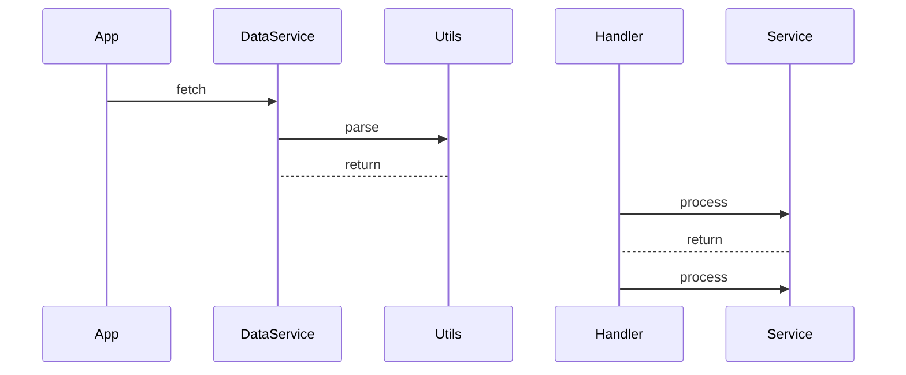

Generating sequence diagram:


Profiler data:
```bash

┌─────────────────────┬───────────┬──────────────────────────────────┬────────────────────────────┬──────────────────┐
│ (index)             │ isPromise │ Thread Blocking Duration (in ms) │ Execution Duration (in ms) │ Invocation Count │
├─────────────────────┼───────────┼──────────────────────────────────┼────────────────────────────┼──────────────────┤
│ Handler.start       │ false     │ 30                               │ 150                        │ 1                │
│ App.init            │ false     │ 20                               │ 100                        │ 1                │
│ Handler.callback    │ false     │ 15                               │ 70                         │ 1                │
│ DataService.fetch   │ true      │ 5                                │ 50                         │ 1                │
│ Service.process     │ false     │ 20                               │ 40                         │ 2                │
│ Utils.parse         │ false     │ 15                               │ 20                         │ 1                │
│ DataService.process │ false     │ 10                               │ 15                         │ 1                │
└─────────────────────┴───────────┴──────────────────────────────────┴────────────────────────────┴──────────────────┘
```
